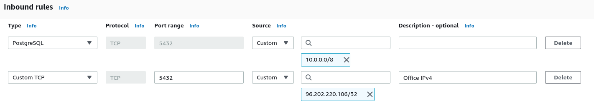
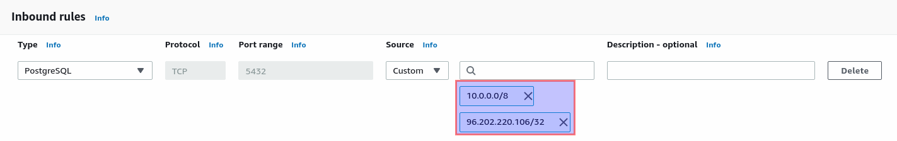

# AWS Security Group Rules Drift Demo

In this article, we'll show how a simple manual change in an AWS Security Group using the AWS Web Console can have bitter security consequences. This one is based on many first-hand experiences and user feedback, in a production context with infrastructure-as-code.

## Allowing PgSQL (with Terraform)

For this article, we'll take the example recently experienced by a team we know.

They secured access to their PgSQL instances with this simple Terraform configuration, allowing only the web servers subnet:

```hcl
// Secure the PgSQL RDS cluster using a dedicated SG
resource "aws_security_group" "pgsql" {
  name        = "PgSQL Security Group"
  description = "PgSQL Security Group"

  tags = {
    Name = "PgSQL Security Group"
  }
}

// PgSQL can only be accessed from the WWW network (10.0.0.0/8)
resource "aws_security_group_rule" "pgsql" {
  type              = "ingress"
  from_port         = 5432
  to_port           = 5432
  protocol          = "tcp"
  cidr_blocks       = ["10.0.0.0/8"]
  security_group_id = aws_security_group.pgsql.id
}

```

They had a scheduled `terraform plan` as a GitHub Action for the whole infrastructure, so if something changed, it was immediately reported.

It worked well and passed initial security audits. Good job!

## That one Security Group temporary change

A couple of years later, to win a new major customer, they agreed to allow a pentesting audit. Long story short, one auditor was pentesting from the internet, while the other worked from different internal networks of the company.

Oddly enough, they didn't come back with the same results: the external audit came clean, while the internal one basically opposed a strict "no-go" to the commercial deal. Reason: the auditor reported he gained access to every customer database in a matter of minutes. With proof.

How could it happen?

One day, someone from the team needed to quickly test something on a customer database who experienced a bug. A single value to change. Going through the hassle of switching to the secure network, then connecting to the corporate VPN, then going through the Bastion using a smartcard for authentication, probably also having to explain soon to the security team why he connected and what he did...this was definitely too much.
Especially when he could simply allow the company's office outgoing IPv4 on the "PgSQL" security group! And remove it after the change. Moreover, he would _necessarily_ remember about it, as all the Security Groups were 100% managed by Terraform on CI.



And it worked well! That team member fixed the customer issue in the database quickly.

And forgot to remove the security group rule, until it was discovered by the auditor, so that he could:

1. connect painlessly to the customer databases from the office
2. then easily find passwords using a tool like [hydra](https://tools.kali.org/password-attacks/hydra) against PostgreSQL.
3. profit.

## How we ended up there?

3 issues are on display here:

1. A team member had AWS Web Console credentials large enough to make Security Group changes
2. The way security group rules are handled by AWS
3. The way the Security Groups were written using Terraform

We can't do much about the first issue: it's the harsh reality of most companies today. Surely enough they need to adopt a proper full GitOps workflow, but most aren't there yet (and won't be for a while).

### The lists are not what they seem

The second issue is confusing because of what can the UI lead you to believe. As developers, we know that `cidr_blocks = ["10.0.0.0/8"]` is a list and that adding an element to it will make it different.

As a developer, I can also easily believe that such a design in the AWS Console would also generate a list, both IPs are listed under the same line, exactly as if I read `["10.0.0.0/8", "96.202.220.106/32"]`:



The thing is, in the end, they end up being two distinct resources and not 2 elements of a list. This will have immediate consequences.

### The way you write your Terraform matters

The third and final issue here is the way the Terraform was written.
Can you guess what happened in CI for months after the manual change wasn't reverted? Nothing.

```shell
$ terraform apply
aws_security_group.pgsql: Refreshing state... [id=sg-0b6af725ba7e7691b]
aws_security_group_rule.pgsql: Refreshing state... [id=sgrule-3696232291]

Apply complete! Resources: 0 added, 0 changed, 0 destroyed.
```

To be more precise, something happened. It's even more insidious. The manual change was added without anyone knowing about it in the `terraform.tfstate` right after the next `terraform apply` happened in CI:

```json
            "ingress": [
              {
                "cidr_blocks": [
                  "10.0.0.0/8"
                ],
                "description": "",
                "from_port": 5432,
                "ipv6_cidr_blocks": [],
                "prefix_list_ids": [],
                "protocol": "tcp",
                "security_groups": [],
                "self": false,
                "to_port": 5432
              },
              {
                "cidr_blocks": [
                  "96.202.220.106/32"
                ],
                "description": "",
                "from_port": 5432,
                "ipv6_cidr_blocks": [],
                "prefix_list_ids": [],
                "protocol": "tcp",
                "security_groups": [],
                "self": false,
                "to_port": 5432
              }
            ],
```

Yes, you can end up with a Terraform state with way more information and resources than you intended from the code.

The way Security Group Rules were written couldn't help discovering the change (not to mention notifying anyone). You could add a billion rules and it would be the same.

If you read Terraform's documentation for the AWS provider (currently v3.36), you'll find 2 options:

1. Use the [aws_security_group](https://registry.terraform.io/providers/hashicorp/aws/latest/docs/resources/security_group) resource with inline `egress {}` and `ingress {}` blocks for the rules.
2. Use the [aws_security_group](https://registry.terraform.io/providers/hashicorp/aws/latest/docs/resources/security_group) resource with additional [aws_security_group_rule](https://registry.terraform.io/providers/hashicorp/aws/latest/docs/resources/security_group_rule) resources.

In this case, using the first option would have been better for this team, see how the next `terraform apply` in CI would have had the expected effect:

```shell
$ terraform apply
aws_security_group.pgsql: Refreshing state... [id=sg-03a12201c68c38d92]

An execution plan has been generated and is shown below.
Resource actions are indicated with the following symbols:
  ~ update in-place

Terraform will perform the following actions:

  # aws_security_group.pgsql will be updated in-place
  ~ resource "aws_security_group" "pgsql" {
        id                     = "sg-03a12201c68c38d92"
      ~ ingress                = [
          - {
              - cidr_blocks      = [
                  - "96.202.220.106/32",
                ]
              - description      = "Allow PgSQL from WWW"
              - from_port        = 5432
              - ipv6_cidr_blocks = []
              - prefix_list_ids  = []
              - protocol         = "tcp"
              - security_groups  = []
              - self             = false
              - to_port          = 5432
            },
            # (1 unchanged element hidden)
        ]
        name                   = "PgSQL Security Group"
        tags                   = {
            "Name" = "PgSQL Security Group"
        }
        # (6 unchanged attributes hidden)
    }

Plan: 0 to add, 1 to change, 0 to destroy.

```

Unfortunately, it's often too late when you realize it, and this not always the best solution for every use case!

## The Driftctl option

That's when using driftctl is always a good option. As the tool compares your Terraform state to the reality of your AWS account, you can deploy the tool at 2 important places of your workflow:

1. as a scheduled run (like an hourly cronjob), so you get reports when something changes
2. as a pre-requisite to a `terraform apply` step in CI: so you make sure no uncontrolled resource ends up in the state: it will alert before.

Here's a `driftctl` run when the activity is as expected on the AWS account:

```shell
$ driftctl scan 
Scanned resources:    (54)
Found 2 resource(s)
 - 100% coverage
Congrats! Your infrastructure is fully in sync.
$ echo $?
0
```

Here's a `driftctl` run with the above manual change:

```shell
$ driftctl scan 
Scanned resources:    (55)
Found resources not covered by IaC:
  aws_security_group_rule:
    - Type: ingress, SecurityGroup: sg-0ce251e7ce328547d, Protocol: tcp, Ports: 5432, Source: 96.202.220.106/32
Found 3 resource(s)
 - 66% coverage
 - 2 covered by IaC
 - 1 not covered by IaC
 - 0 missing on cloud provider
 - 0/2 changed outside of IaC
$  echo $?
1
```

There's a ton of other options and integrations you can use with `driftctl`, but that will be for another article!

Reference: 

- [driftctl.com](https://driftctl.com)
- [driftctl GitHub](https://github.com/cloudskiff/driftctl)
- [driftctl Documentation](https://docs.driftctl.com)
- Terraform AWS Provider resources documentation: [`aws_security_group_rule`](https://registry.terraform.io/providers/hashicorp/aws/latest/docs/resources/security_group_rule) and [`aws_security_group`](https://registry.terraform.io/providers/hashicorp/aws/latest/docs/resources/security_group)
